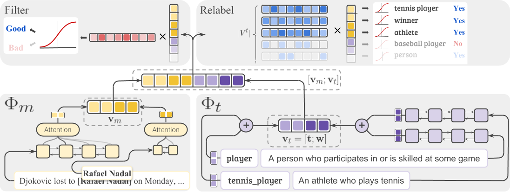

# Learning to Denoise Distantly-Labeled Data for Entity Typing

This is a PyTorch implementation of the fine-grained entity typing system presented in the NAACL 2019 paper [Learning to Denoise Distantly-Labeled Data for Entity Typing]().

The code will be available soon!
